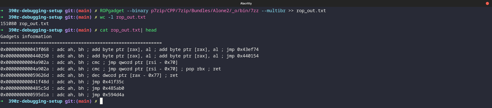
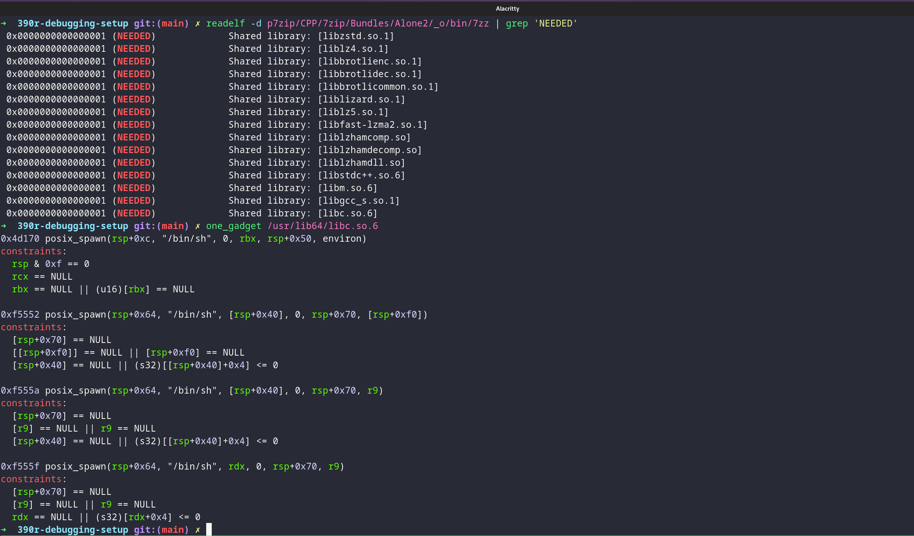
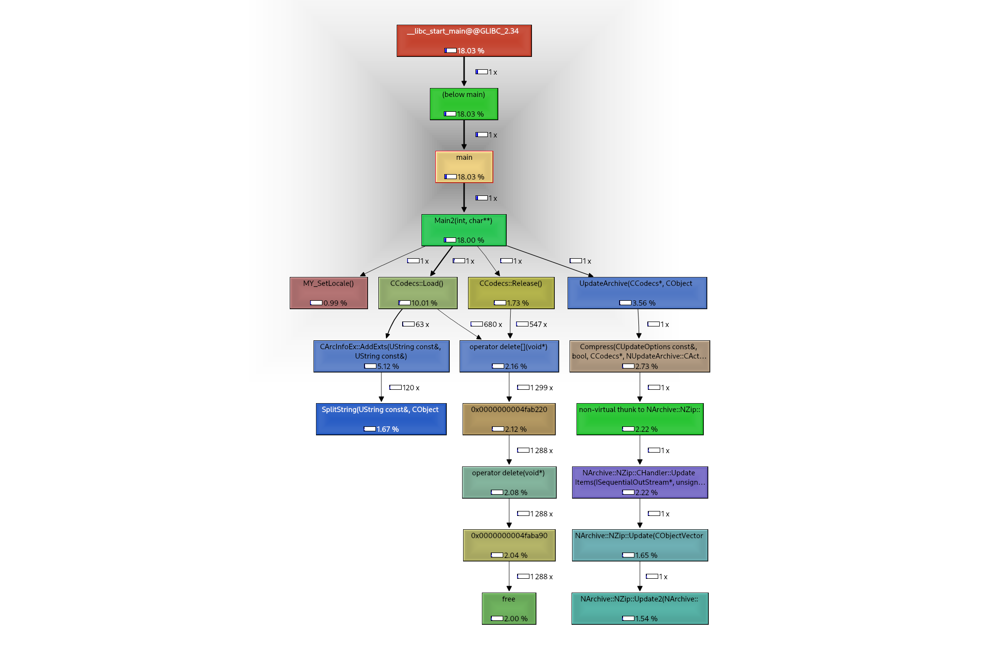
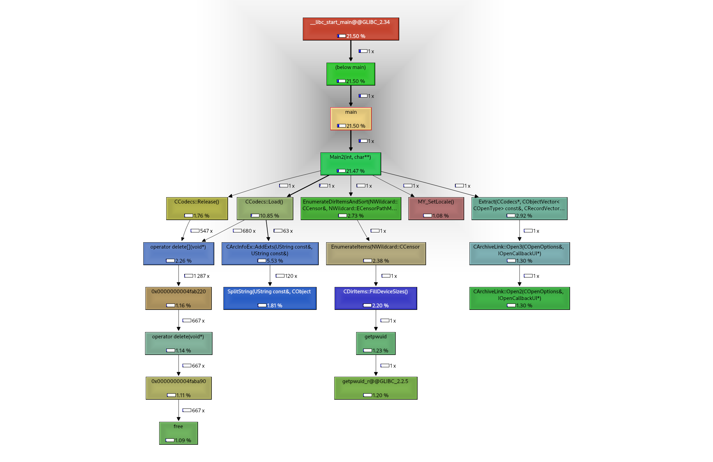

# Vulnerability Research and Analysis on `p7zip`

- Our work is based off the `p7zip` repository located at: https://github.com/jinfeihan57/p7zip

## Reading

For a detailed explanation of the vulnerability analysis carried out by this repository, take a look at each of the writeup PDFs in the [writeups](./writeups/) directory.

For a TLDR, look at [writeups/deck/p7zip-deck.pdf](./writeups/deck/p7zip-deck.pdf) which is a short presentation of our analysis.

## Build target

To build any form of the target, use the different Makefile targets.

```bash
$ make <target>
```

The following major targets are available:

1. `default`
2. `debug`
3. `afl`
4. `afl-asan`
5. `afl-asan-dbg`
6. `afl-msan`
7. `afl-ubsan`
8. `afl-cfisan`
9. `afl-tsan`

Each of these targets clone a fresh version of the `p7zip` repository, patch the Makefiles in the directory according to their variant, and builds the `7zz` executable. The final executable of the target is available at `BIN_DEFAULT/CPP/7zip/Bundles/Alone2/_o/bin/7zz`

Each of these variants also have a `-harness` build for building a version with a harness for fuzzing the `archive` feature of the binary.

To experiment with the `default` binary, run `make default` and add this to your `PATH` variable:

```bash
PATH=$PATH:$PWD/7zz_default/CPP/7zip/Bundles/Alone2/_o/bin
```

## Run target

### List of commands

```bash
7zz -h
```

### Simple tests

```bash
cd playground
7zz a files.zip file1.txt file2.txt
7zz e files.zip -ofiles_extracted
```

## Fuzzing

### Installing AFL++

Install [american-fuzzy-lop-clang](https://github.com/AFLplusplus/AFLplusplus)

For the sanitizer variants, you may need to install dependencies such as `libasan, libtsan, devel` packages etc.

### Compiling an AFL compatible binary

Use the `Makefile` targets in the root of the repository to compile different flavors of instrumented AFL binaries.

### Retrieving the input corpus

For all next steps, you should be in the `fuzzing` directory.

Run one of the following:

```bash
make get-inputs
make get-inputs-for-archive
```

### Minimizing the input corpus

Run one of the following:

```bash
make minimize-afl
make minimize-afl-asan
```

### Fuzzing with inputs on Local

```bash
cd fuzzing
mkdir -p fuzzing-work && cp Makefile fuzzing-work && cd fuzzing-work
make get-inputs
make minimize
make fuzz-afl
```

## Code Analysis

### CodeQL

- Installing CodeQL

```bash
cd codeql-playground
wget https://github.com/github/codeql-cli-binaries/releases/download/v2.13.0/codeql-linux64.zip
unzip codeql-linux64.zip
PATH=$PATH:$PWD/codeql
```

- Creating a codeql database for p7zip

```bash
cd <ONE OF THE TARGET DIRS>/CPP/7zip/Bundles/Alone2
codeql database create ../../../../../codeql-playground/analysis-db.codeql -l cpp -c "make -B -f makefile.gcc" --overwrite
cd -
```

- Analyzing database with codeql

```bash
codeql pack download codeql/cpp-queries
codeql database analyze analysis-db.codeql --format CSV --output analysis.csv
```

### Joern

- Installation requires `JDK`

```bash
curl -L "https://github.com/joernio/joern/releases/latest/download/joern-install.sh" -o joern-install.sh
chmod u+x joern-install.sh
./joern-install.sh --interactive
```

- Basic tests

```joern
importCode(inputPath="../p7zip/CPP", projectName="p7zip-dbg")
```
## General Target analysis

### File format


### Mitigations


### ROP Gadgets



### One Gadgets



### Function call graph

The following can be used to analyze execution of the target and produce graphs. It requires `valgrind` and `kcachegrind` to be installed.

```bash
valgrind --callgrind-out-file=callgrind_vis2 --tool=callgrind 7zz e files.zip -ofiles_extracted
kcachegrind callgrind_vis2
```

Below are two call graphs produced for the archive and extract commands:




