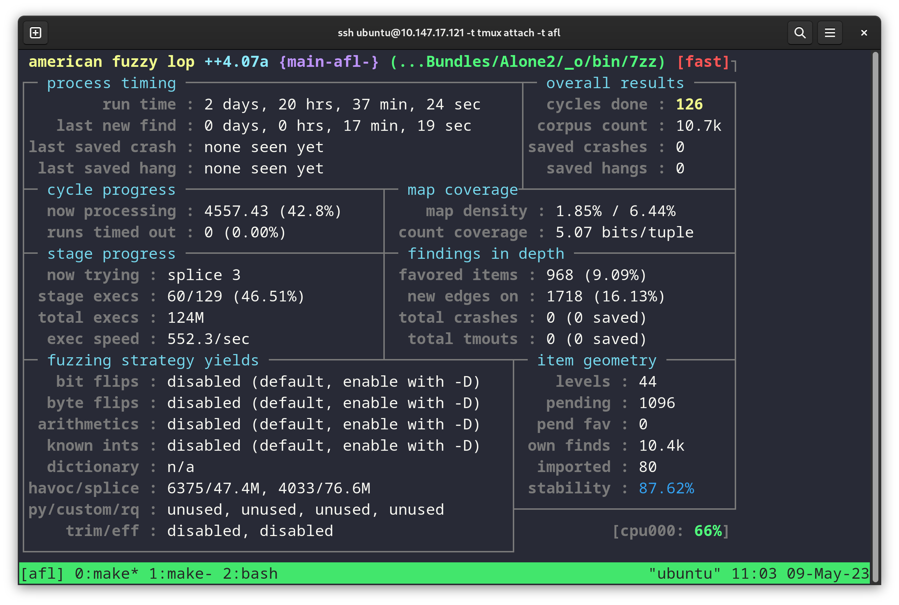

Target Overview

- p7zip is an open-source POSIX port of the popular Windows utility 7zip
- Supports extracting and archiving a large number of formats
- Implements several compression algorithms (codecs)
- Hosts a CLI frontend
- Used in almost all GUI ZIP programs in Windows
- Also includes cryptographic algorithms for archive encryption

Building the Target
- All our build instructions are in our Github Repo
- https://github.com/atharvakale343/p7zip-390r

We have a Makefile that supports the following build targets:

- default (as-is)
- debug (-g2 -O0 CFLAGS)

AFL Fuzzing Buildings:
- AFL instrumentation (afl)
- ASAN
- MSAN
- UBSAN
- CFISAN
- TSAN

Dynamic Analysis

Fuzzing

- Fuzzing is a popular technique against binary targets
- We fuzzed p7zip's extract (e) subcommand
- afl-plus-plus (https://github.com/AFLplusplus/AFLplusplus)

Generating a corpus

- Goal: Find a varied corpus that hits several compression formats
- We found a decent corpus at https://github.com/strongcourage/fuzzing-corpus

Makefile target: get-inputs

Minimizing the Corpus
- Used tools:
- afl-cmin
    - Ensures only "interesting" inputs are considered
- afl-tmin
    - Strips the input to make it lightweight
- We found that these two steps significantly increased coverage of our fuzzing efforts

Makefile target: minimize

Fuzzing Composition Flags

- Discovered not sufficient to just fuzz a vanilla `afl` binary

(Put red circle emoji)

Fuzzing Composition Flags

- Looked to several sanitizers to find non-crashing bugs

We used the following sanitizers on our target:
- ASAN: Address Sanitizer: discovers memory error vulnerabilities such as use-after-free,
heap/buffer overflows, initialization order bugs etc.
- MSAN: Memory Sanitizer: mainly used to discover reads to uninitialized memory such as structs
etc.
- TSAN: Thread Sanitizer: finds race conditions

Makefile target: fuzz-afl-<sanitizer>

Parallel Fuzzing

- Discovered it is efficient to have one fuzzer running of each type
- Set up a main fuzzer with several service fuzzing
- All fuzzers share same output dictionaries

(Cybersec room servers ftw)

Potential Bugs Discovered