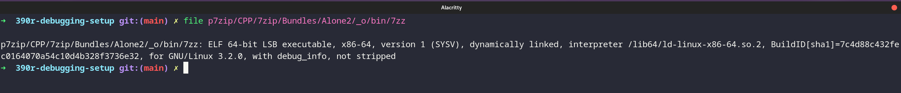
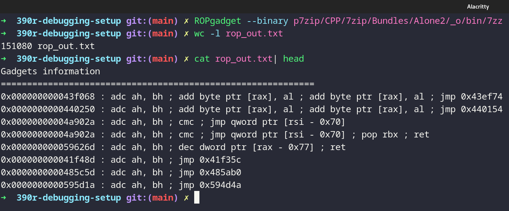
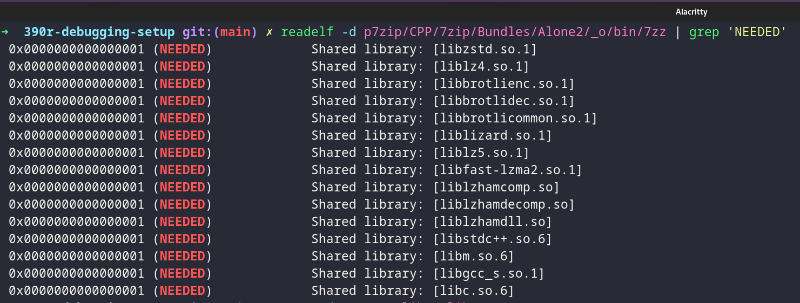
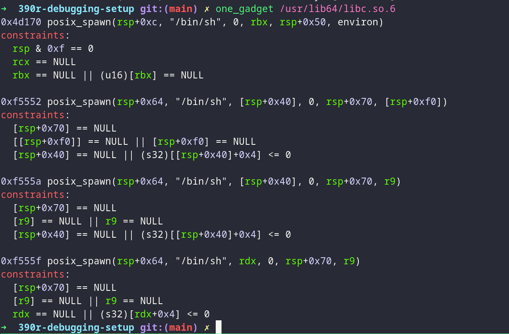
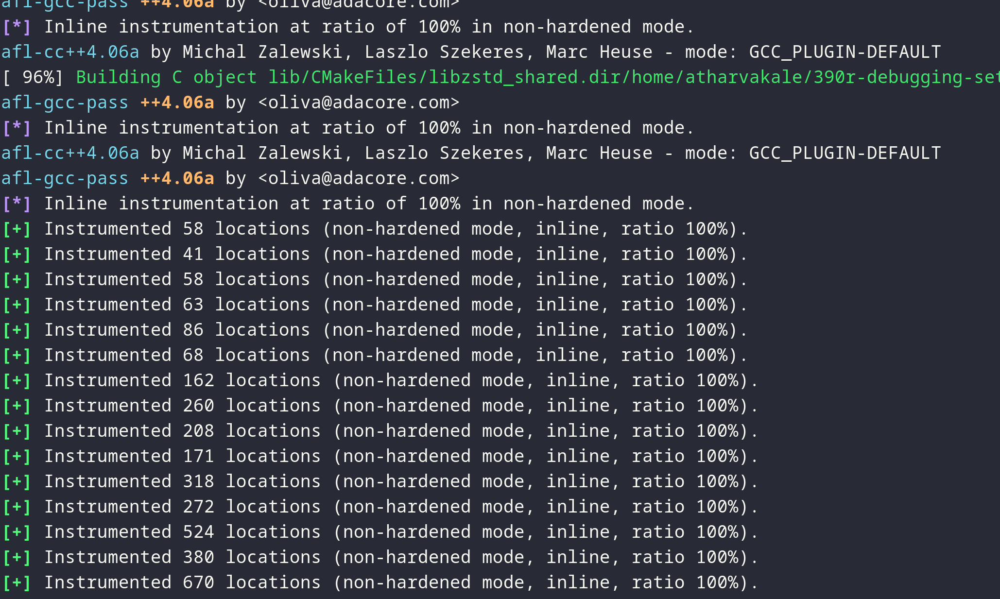
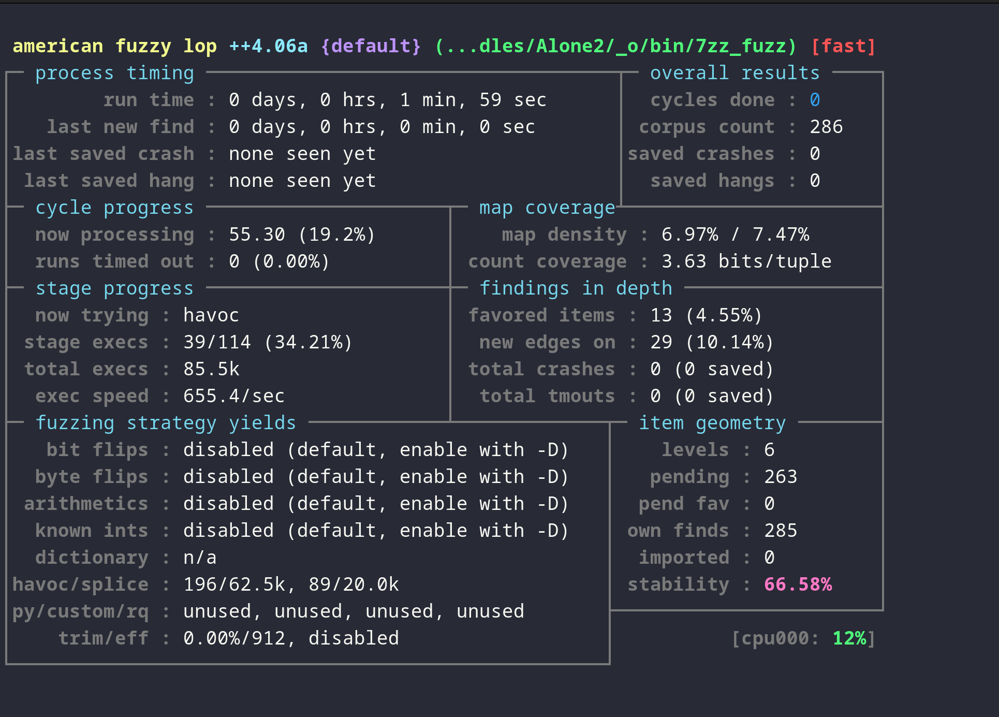

# Checkpoint 1

## Contents:

-   [Overview of the Target](#overview-of-the-target)
-   [Debug Environment](#debug-environment)
-   [Mapping out the Target Code-Base](#mapping-out-the-target-code-base)
-   [Future Plans](#future-plans)

\newpage

## Overview of the Target

**p7zip** is a fully compliant linux port of the open source _7zip_ tool for Windows. It is a utility used to archive and extract various compression formats. It is primarily used in Windows GUI tools as an underlying utility to support their file compression features.

_p7zip_ provides the following features:

1. Several compression algorithms (_lz4_, _zstd_, _Lizard_, etc...)
2. CLI frontend
3. Cryptographic algorithms for archive encryption (_SHA256_, _AES_, _RAR5_, etc...)

\newpage

## Debug Environment

### How to build the target

**Step 1:**

```bash
git clone git@github.com:jinfeihan57/p7zip.git
```

We clone [jinfeihan57's repo](https://github.com/jinfeihan57/p7zip), which is a _Linux port_ for the 7zip Windows utility. The port is _fully compliant_ with the Windows equivalent, and supports all the same formats.

**Step 2:**

```bash
cp 7zip_gcc_dbg.mak p7zip/CPP/7zip/7zip_gcc.mak
```

We created a custom `Makefile` that patches the original build script to include debug flags. We copy the patch into the correct directory.

**Step 3:**

```bash
cd p7zip/CPP/7zip/Bundles/Alone2 && make -f makefile.gcc && cd -
```

We build the `7zz` tool, which is the primary binary from the project, which supports archiving and extracting the most number of formats.

**Step 4:**

```bash
PATH=$PATH:$PWD/p7zip/CPP/7zip/Bundles/Alone2/_o/bin
```

For development purposes, we update the current terminal session's `PATH` to include the path to the `7zz` binary.

### Experiment with the Target

\begin{figure}[H]
\centering
\includegraphics[width=400px]{screenshots/list-of-commands.png}
\caption{List of commands}
\end{figure}

**Simple tests**

In the `playground` directory, we have some sample files setup for basic tests.

```bash
cd playground
7zz a files.zip file1.txt file2.txt
7zz e files.zip -ofiles_extracted
```

### Target analysis

{width=400}

{width=400}

{width=400}

{width=400}

{width=400}

**Function call graph**

The following can be used to analyze execution of the target and produce graphs. It requires `valgrind` and `kcachegrind` to be installed.

```bash
valgrind --callgrind-out-file=callgrind_vis2 --tool=callgrind 7zz e files.zip -ofiles_extracted
```

Use the `valgrind` command above to generate a `callgrind_vis2` file.

```bash
kcachegrind callgrind_vis2
```

Use the `kcachegrind` command to visualize the `callgrind_vis2`.

In the next two pages, we fine two function call graphs for the `archive` and `extract` subcommands.
\newpage

**Archive Command:**


\newpage
**Extract Command:**


\newpage

## Mapping out the Target Code-Base

The functionality of the console version of this application is straightforward. The binary accepts command line arguments (`main` defined in _MainAr.cpp_), then attempts to pass them to `main2()` in _Main.cpp_ (wrapped in try block).

`main2()` handles the bulk of all functionality.

It parses command line arguments beginning at line 733. Argument length is checked, arguments are converted to Unicode and pushed to a string vector.

Arguments are first parsed into the following struct using `parse1()` defined in the _ArchiveCommandLine.cpp_.

```c
struct CArcCmdLineOptions
{
  bool HelpMode;

  // bool LargePages;
  bool CaseSensitive_Change;
  bool CaseSensitive;

  bool IsInTerminal;
  bool IsStdOutTerminal;
  bool IsStdErrTerminal;
  bool StdInMode;
  bool StdOutMode;
  bool EnableHeaders;

  bool YesToAll;
  bool ShowDialog;
  bool TechMode;
  bool ShowTime;

  AString ListFields;

  int ConsoleCodePage;

  NWildcard::CCensor Censor;

  CArcCommand Command;
  UString ArchiveName;
```

First arguments checked are related to showing _help/copyright_, and calls the `ShowCopyRightAndHealth()` function.

Then `parse2()` is called on the options struct.

_ArchiveCommandLine.cpp_ handles a bunch of flags that can be passed, ie. SLP mode (large pages), core affinity, etc. Also contains several other methods for parsing.

Importantly, it defines the formats of arguments. Beginning on line 341, `isFromExtractGroup()` is defined. We see there are extract, and extractFull flags.

A scanner is defined in _ExtractCallbackConsole.cpp_, and this is presumably used to enumerate files in an archive.

\newpage

## Future Plans

### Fuzzing

We plan to use fuzzing as an approach to find bugs in **p7zip**. In specific, mutational fuzzing would be a good fit, where we would use a corpus of ZIP and regular files to test the archiving/extracting features of the binary.

To start with, we used the `AFL++` docker container setup:

```bash
docker pull aflplusplus/aflplusplus
docker run -ti -v .:/src aflplusplus/aflplusplus
```

Then, we re-compiled the binary with AFL instrumentation enabled.

{width=450}

We also started a dummy test for archive to see how fuzzing the binary works. Of course, this does not crash the binary, but we got a working template. We need to figure out ways to smarten the input and find coverage through symbolic execution.

{width=450}
