# Checkpoint 2

## Contents:

-   [Checkpoint 2](#checkpoint-2)
    -   [Contents:](#contents)
    -   [Static Analysis](#static-analysis)
    -   [Dynamic Analysis](#dynamic-analysis)
        -   [Generating a corpus](#generating-a-corpus)
        -   [Experimenting with fuzzing composition flags](#experimenting-with-fuzzing-composition-flags)
        -   Parallel fuzzing
        -   Results

\newpage

## Github Link

[https://github.com/atharvakale343/390r-debugging-setup](https://github.com/atharvakale343/390r-debugging-setup)

## Dynamic Analysis

## Fuzzing

Fuzzing was the main dynamic analysis technique we used against our target `p7zip`. We mainly fuzzed the extract (`e`) feature of our binary as the feature uses several decompression algorithms as part of its execution.

We used `afl-plus-plus` as the primary fuzzing tool.

[https://github.com/AFLplusplus/AFLplusplus](https://github.com/AFLplusplus/AFLplusplus)

## Generating a corpus

We took a variety of steps to find a good enough corpus for our fuzzing efforts. The major approach here to was to search online for commonly used corpora. Our main goals here was to find not only `.zip` format, but also as many different formats possible.

We found a decent corpus at [https://github.com/strongcourage/fuzzing-corpus](https://github.com/strongcourage/fuzzing-corpus)

This included the following formats:

-   `.zip`
-   `.gzip`
-   `.lrzip`
-   `.jar`

We added this as a target to our fuzzing Makefile.

```Makefile
get-inputs:
	rm -rf in_raw fuzzing-corpus && mkdir in_raw

	git clone -n --depth=1 --filter=tree:0 git@github.com:strongcourage/fuzzing-corpus.git
	cd fuzzing-corpus && git sparse-checkout set --no-cone zip gzip/go-fuzz lrzip jar && git checkout
	mv fuzzing-corpus/zip/go-fuzz/* in_raw
	mv fuzzing-corpus/jar/* in_raw
	mv fuzzing-corpus/gzip/go-fuzz/* in_raw
	mv fuzzing-corpus/lrzip/* in_raw
```

The next step was to choose only "interesting" inputs from this corpus. This includes small inputs that don't crash that binary immediately.

We used the `afl-cmin` functionality to minimize the corpus.

```bash
afl-cmin -i in_raw -o in_unique -- $(BIN_AFL) e -y @@
```

Another important minimization step included `tmin`. This augments each input such that it can be as small as possible without compromising it's ability to mutate and produce coverage in the instrumented target.

Unfortunately, this process takes a long time, and it only completed for us after a day.

```bash
cd in_unique; for i in *; do afl-tmin -i "$$i" -o "../in/$$i" -- ../$(BIN_AFL) e -y @@; done
```

The cybersec room servers come in handy here!

## Experimenting with fuzzing composition flags

We discovered that it is not enough to fuzz a plain instrumented target with `afl-plus-plus`. The target binary may not be easily crashed with mutated inputs as `p7zip` has a robust input error checker. We took to fuzzing with various sanitizers instead to search for harder to find bugs.

We used the following sanitizers on our target:

-   ASAN: Address Sanitizer: discovers memory error vulnerabilities such as use-after-free, heap/buffer overflows, initialization order bugs etc.

-   MSAN: Memory Sanitizer: mainly used to discover reads to uninitialized memory such as structs etc.

-   TSAN: Thread Sanitizer: finds race conditions

```Makefile

fuzz-afl:
	AFL_SKIP_CPUFREQ=1 AFL_I_DONT_CARE_ABOUT_MISSING_CRASHES=1 $(AFL_FUZZ) -M main-afl-$(HOSTNAME) -t 30000 -i in -o out -- $(BIN_AFL) e -y @@

fuzz-afl-asan:
	AFL_SKIP_CPUFREQ=1 AFL_I_DONT_CARE_ABOUT_MISSING_CRASHES=1 $(AFL_FUZZ) -S variant-afl-asan -t 30000 -i in -o out -- $(BIN_AFL_ASAN) e -y @@

fuzz-afl-msan:
	AFL_SKIP_CPUFREQ=1 AFL_I_DONT_CARE_ABOUT_MISSING_CRASHES=1 $(AFL_FUZZ) -S variant-afl-msan -t 30000 -i in -o out -- $(BIN_AFL_MSAN) e -y @@

fuzz-afl-tsan:
	AFL_SKIP_CPUFREQ=1 AFL_I_DONT_CARE_ABOUT_MISSING_CRASHES=1 $(AFL_FUZZ) -S variant-afl-tsan -t 30000 -i in -o out -- $(BIN_AFL_TSAN) e -y @@
```

### Parallel Fuzzing

To start with, our approach was to fuzz the `extract` command of `7zz`. So we found an appropriate corpus and fuzzed with the `e` command-line argument (along with `-y` to account for same filenames / avoid user input hangs).

With all different sets of compilation flags that we mentioned previously, we compiled the binaries with AFL instrumentation. Then, to more effectively fuzz, we setup a parallel fuzzing environment in one of the **CyberSec club** VMs.

We added the `afl-fuzz` commands in a `Makefile` and followed the official [guide](https://github.com/AFLplusplus/AFLplusplus/blob/stable/docs/fuzzing_in_depth.md#c-using-multiple-cores) for using multiple cores. Below are the commands we utilized. All of our fuzzers shared the same input and output directores to keep track of current fuzzing state.

```bash
AFL_SKIP_CPUFREQ=1 AFL_I_DONT_CARE_ABOUT_MISSING_CRASHES=1 $(AFL_FUZZ) -M main-afl-$
(HOSTNAME) -t 2000 -i in -o out -- $(BIN_AFL) e -y @@
```

Our main fuzzer used a regular instrumented AFL binary with no other `CFLAGS`. We used a timeout of 2 seconds to denote a hang (or infinite loops).

```bash
AFL_SKIP_CPUFREQ=1 AFL_I_DONT_CARE_ABOUT_MISSING_CRASHES=1 $(AFL_FUZZ) -S variant-af
l-asan -t 2000 -i in -o out -- $(BIN_AFL_ASAN) e -y @@
```

Our variant fuzzers utilized binaries compiled with other flags (such as _asan_ and _msan_). These had the same timeout as before of 2 seconds.

To keep track of all fuzzers and run them simultaneouly, we used `tmux` sessions with a separate window for each fuzzer.

### Results

We ran the fuzzers using multiple cores for around 2.5 days. We noticed no crashes in most of the variants, with msan being the exception. However, some fuzzers encountered hangs.

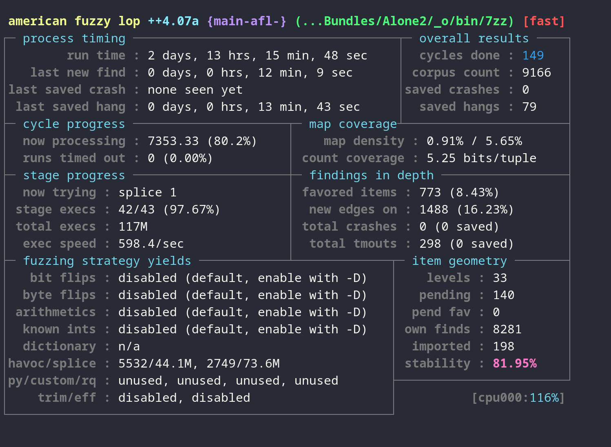

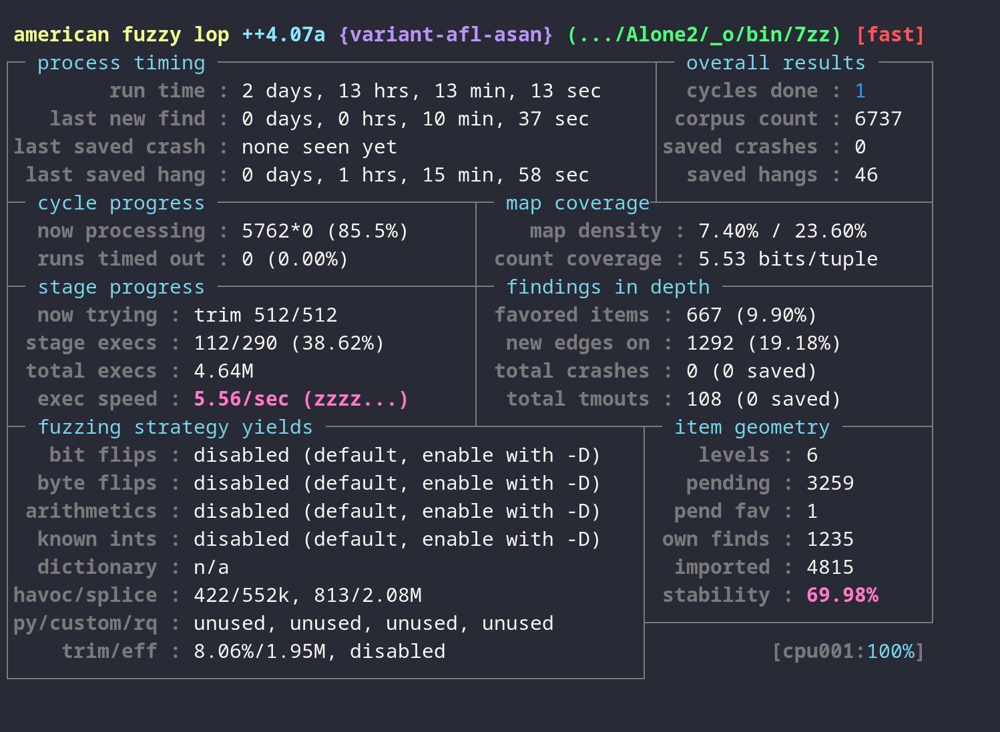

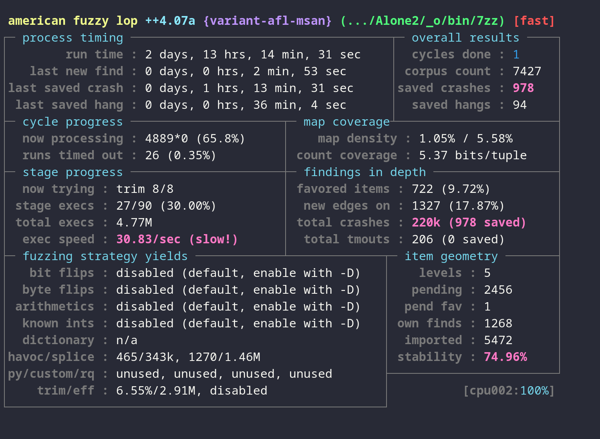

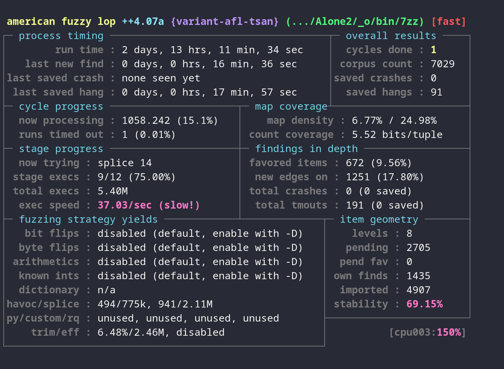

We tried running an input from `in/hangs` to check where an infinite loop could occur. But, all inputs eventually completed while taking longer than 2 seconds, so we concluded that the timeout value was too low. These executions were incorrectly flagged as hangs due to relatively low timeouts. For our next fuzzing attempts, we plan to increase this and make the timout around 30 seconds to account for larger file inputs.

**Analyzing msan crashes**

As the msan variant was the only one that produced crashes, we compiled a msan binary with debug flags and analyzed the crash.

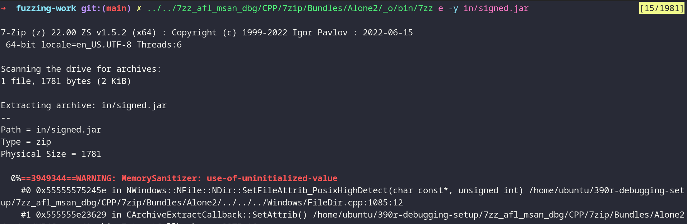

As displayed above, the crash occurs due to a use of uninitialized value in _FileDir.cpp_.

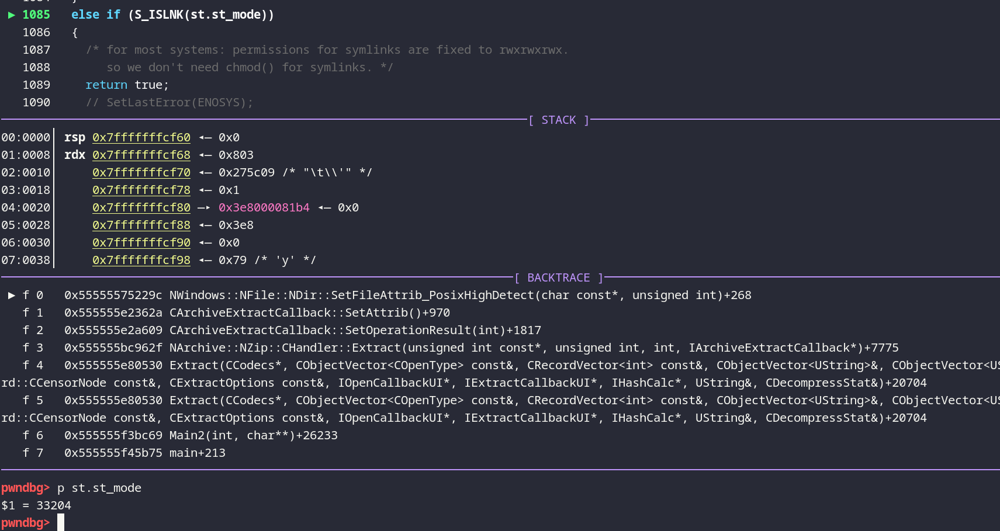

From previous error message, we see that msan has flagged `st.st_mode` as uninitialized. But, looking into **gdb**, this variable seems to be defined, set to 33204. This is because it was called with `lstat(path, &st)` at the beginning of the function, which initialized all fields of the struct.

From this, we can conclude that msan had incorrectly flagged this an uninitialized and this is a _false positive_. All other msan crashes refer to the same line, so we determined that **msan** is not a good fit for this project, possibly missing out on initializers.

We looked more into [clang documentation](https://clang.llvm.org/docs/MemorySanitizer.html), which affirmed this belief:

> it may introduce false positives and therefore should be used with care

## Static Analysis

### Codeql

To analyze the code for common C/C++ bugs, we used **codeql** to scan the source code.

We first created a analysis database by providing the `make` instructions to codeql.

```bash
cd p7zip/CPP/7zip/Bundles/Alone2
codeql database create ../../../../../codeql-playground/analysis-db.codeql -l cpp -c "make -B -f makefile.gcc" --overwrite
cd -
```

Then, we download _cpp-queries_ and tested the produced database against it.

```bash
codeql pack download codeql/cpp-queries
codeql database analyze analysis-db.codeql --format CSV --output analysis.csv
```

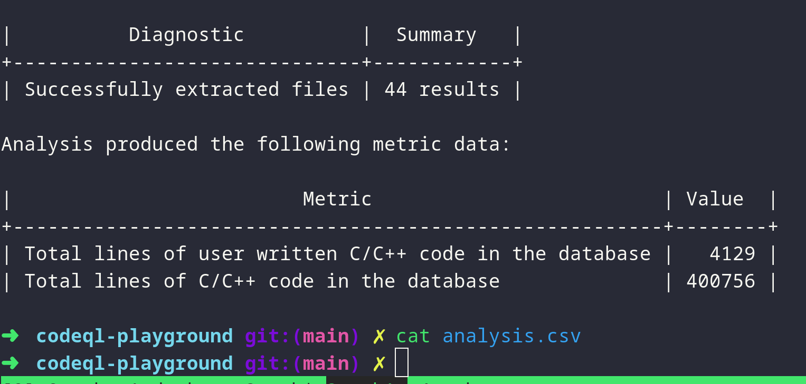

But, this did not output any glaring errors, executing without any warnings or useful metrics. We concluded that codeql only utilizes simple checks which would have already been accounted for in the source code.

### CPPCheck

We ran the codebase through the static analysis tool cppcheck, which tagged 1569 warnings and errors. One of the common errors flagged by cppcheck was shiftTooManyBits

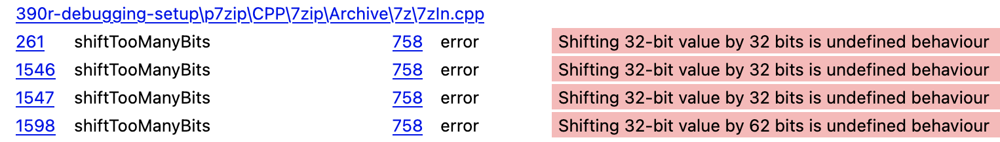

Unfortunately, when looking at the actual source code, almost all of these errors come from an innocuous function:


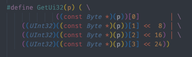

The rest, on closer inspection, are also falsely flagged as errors, such as this one:


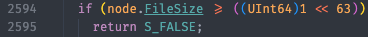

A more promising error seems to be a possible null pointer exception:

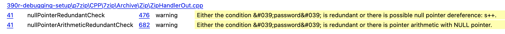
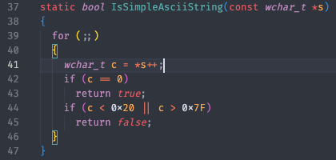

This function is only called once, in the same file at line 415:

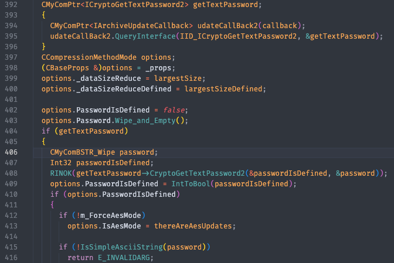

It looks like `password` gets populated in `CryptoGetTexPassword2`, looking at that function, and the subsequent call to StringToBstr, it unfortunately looks like the nullpointer is properly checked for.

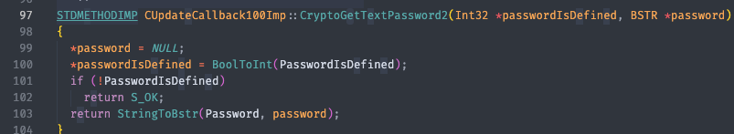

