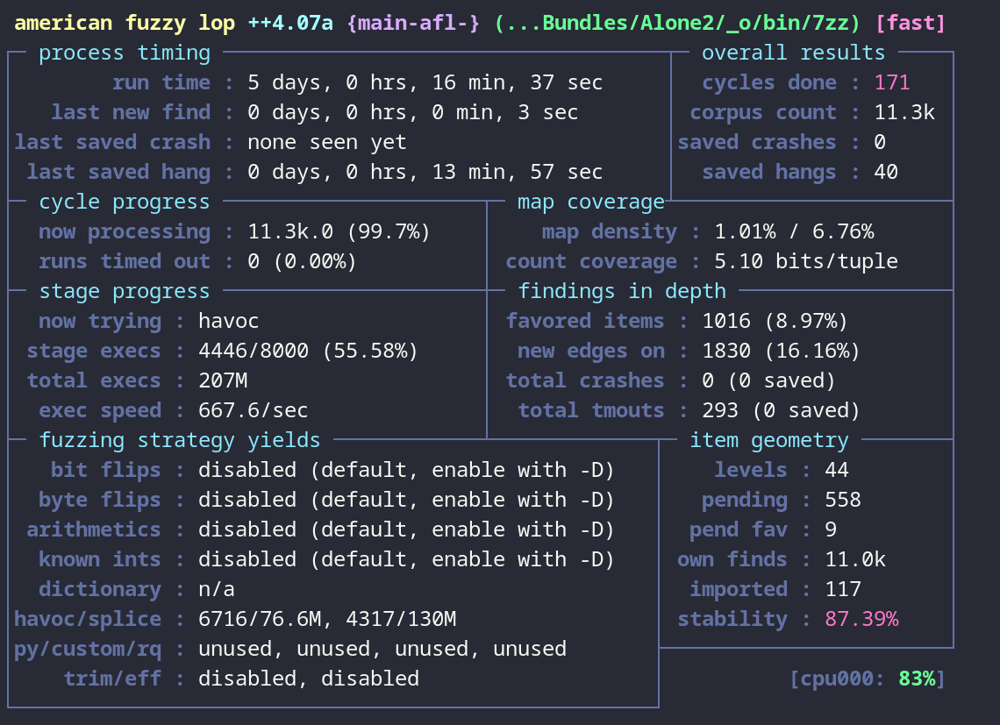

# Checkpoint 1

    Public Github Repository - This should include all code you wrote for eg. static analysis, fuzzing harnesses, etc. If you built your target with instrumentation for the purposes of fuzzing, this should also include build scripts. If you performed reverse engineering on your target and eg. started renaming variables/functions/did work on that front, include the relevant ghidra files as well.

    Start your writeup with a description of what you learned about this target. This should include some notes about the code layout, maybe some coding practices you noticed while going through the target or just more general functionality. Which parts of the target did you think were most interesting for the purposes of finding bugs?

    Describe what you chose for your automated analysis portion and why. How did you set this up, did you encounter issues (eg. slow fuzzer performance), and if so what did you to improve on these issues.

    What were the biggest challenges you faced when dealing with your target?

    If given more time, what do you think would be good next steps to continue doing research on the target with the goal of finding bugs?

## Contents:

-   [Github Repository]()
-   [Overview of the Target]()
    - Code Layout
    - Coding Observations
    - Analyzing a Target Feature
-   [Automated Analysis]()
    - Fuzzing
        - How was it set up
        - Results etc...
    - Static Analysis
        - ...
-   [Challenges Faced]()
    - ...
-   [Next Steps]()

\newpage

